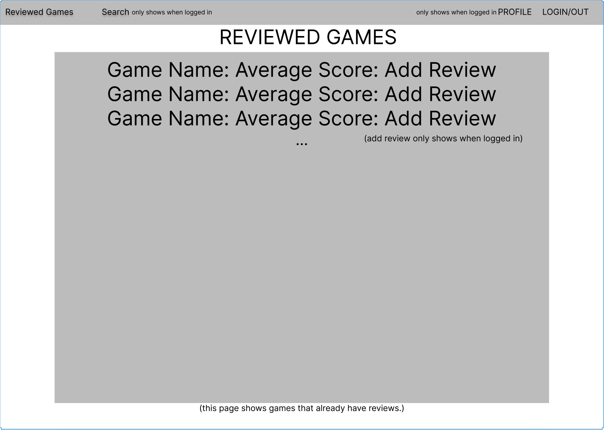
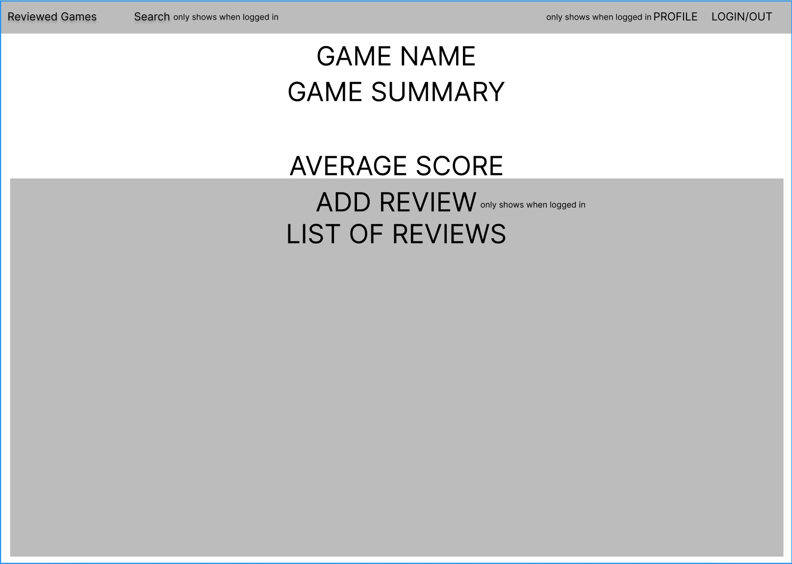
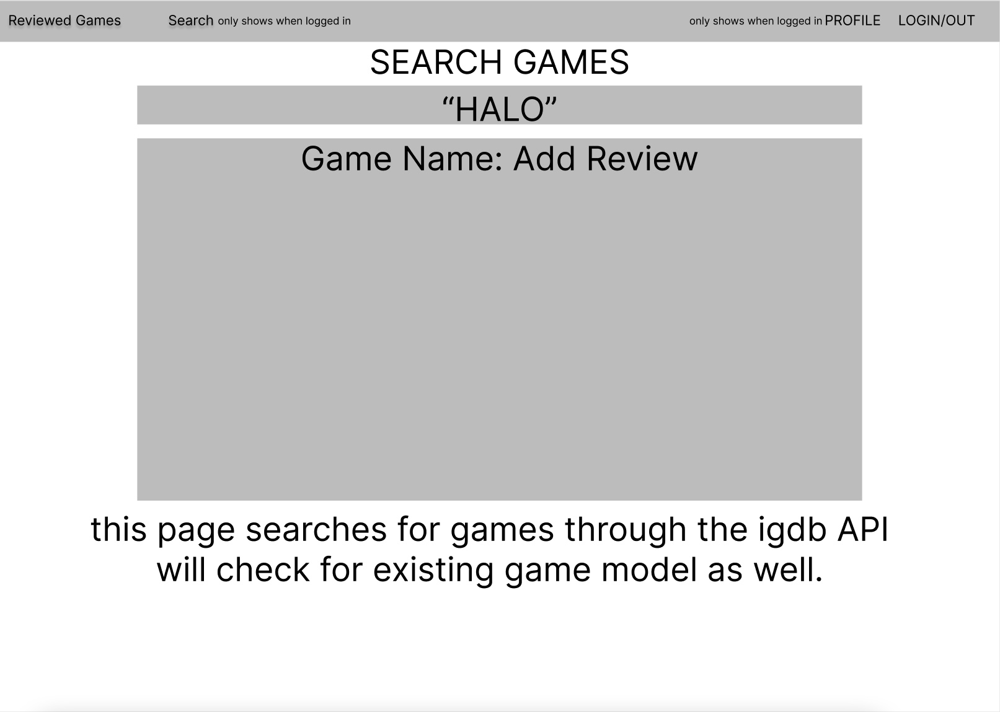
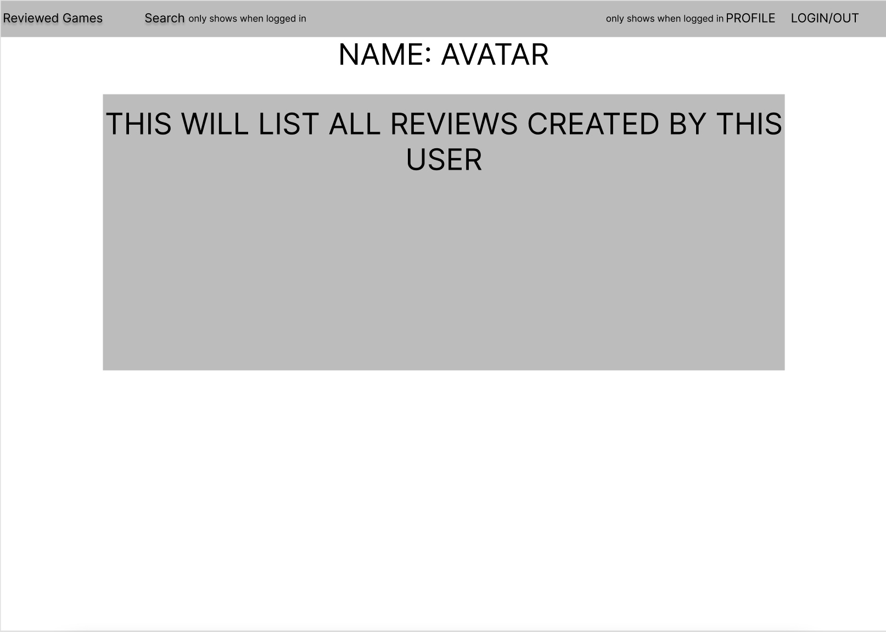

# My Game Reviews Website
https://my-videogames-review.herokuapp.com/games
## Technologies Used
* Node.js
* Mongoose
* Atlus Database
* IGDB API, https://api-docs.igdb.com/#about
* Heroku
* Google OAuth2
## Purpose of the website
* AAU, I want to be able to search for a game and create a review.
* AAU, I want to be able to edit and delete my own reviews.
* AAU, I want to look at all reviews for a game.
* AAU, I want to see a list of games with reviews.
* AAU, I want to see a users reviews in their profile.
## Link to trello
[Trello](https://trello.com/invite/b/4GTeRKv7/2fd075d16375be05be3014c841cdbeba/project-2-games-review-website)
## ERD

## Wireframe

## Routes
| HTTP METHOD | URL Endpoint      | Controller Action | Purpose                                                                  |
|-------------|-------------------|-------------------|--------------------------------------------------------------------------|
| GET         | /games            | gamesCtrl.index   | List all of the games with a review                                      |
| GET         | /games/:id        | gamesCtrl.show    | Show details of game + all reviews                                       |
| GET         | /games/search     | gameCtrl.search   | Searches the IGDB API so the user can add a game                         |
| POST        | /games/:id/review | reviewCtrl.create | Called when a review for a game generates a new game model using the API |
| PUT         | /games/:id/edit   | reviewCtrl.edit   | Called when a user wants to edit a review for a game.                    |
| DELETE      | /games/:id        | reviewCtrl.delete | Called when a user wants to delete their review                          |
| GET         | /user/:id         | userCtrl.show     | Called when user profile is opened, shows the users reviews              |
